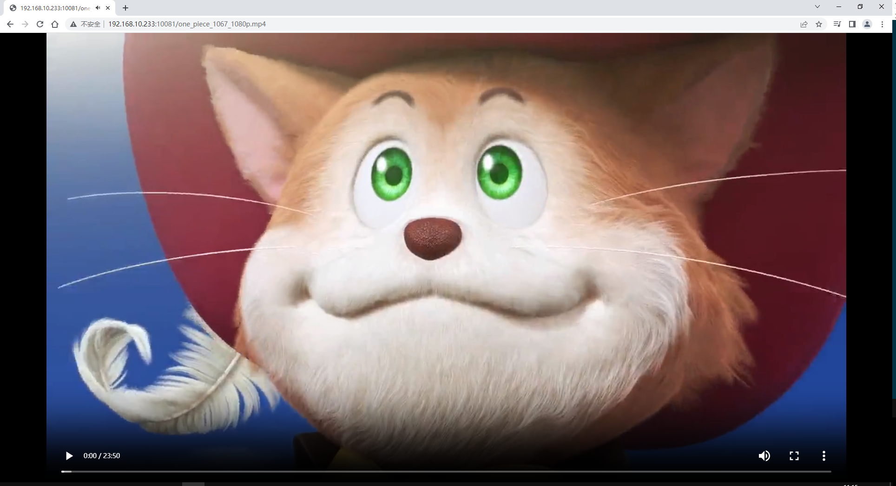
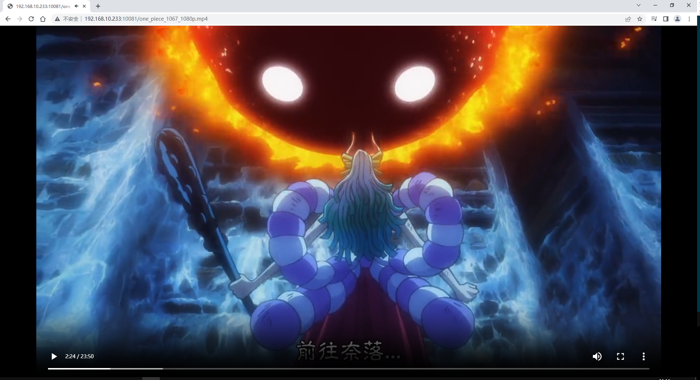

# eibisu/nginx-extras

Nginx视频流媒体服务的docker镜像，使用了nginx-extras模块，可通过浏览器直接播放MP4。





## 使用方法

```shell
docker run -d --name nginx-extras -p 10081:80 -v /home/nginx-extras/video:/home/video --restart=always eibisu/nginx-extras
```

将MP4文件存放到`/home/nginx-extras/video`目录下，在浏览器通过`ip<:port>/资源名称`即可播放。